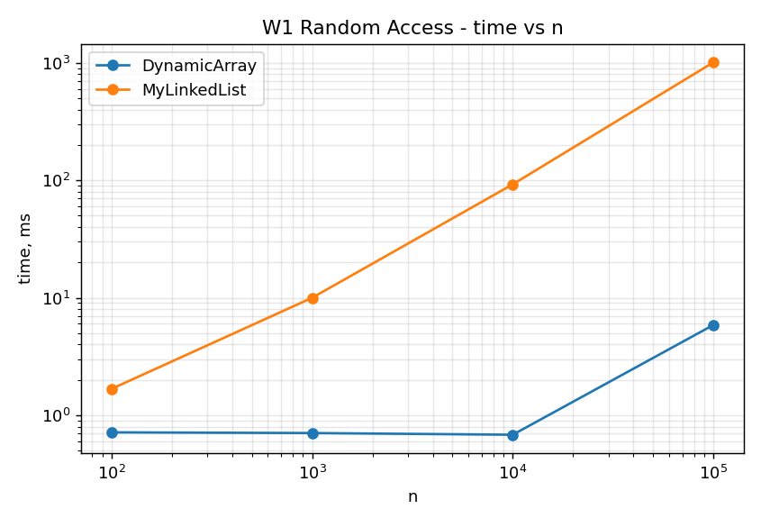
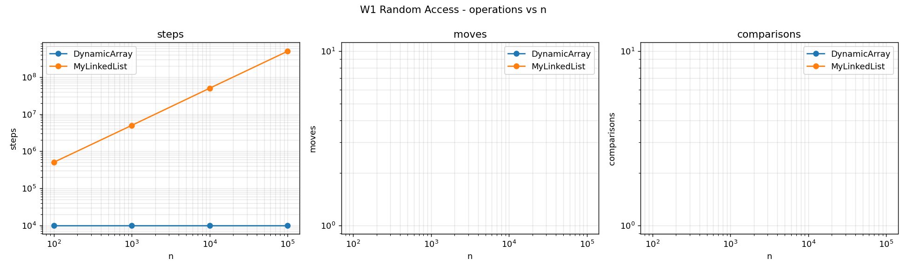
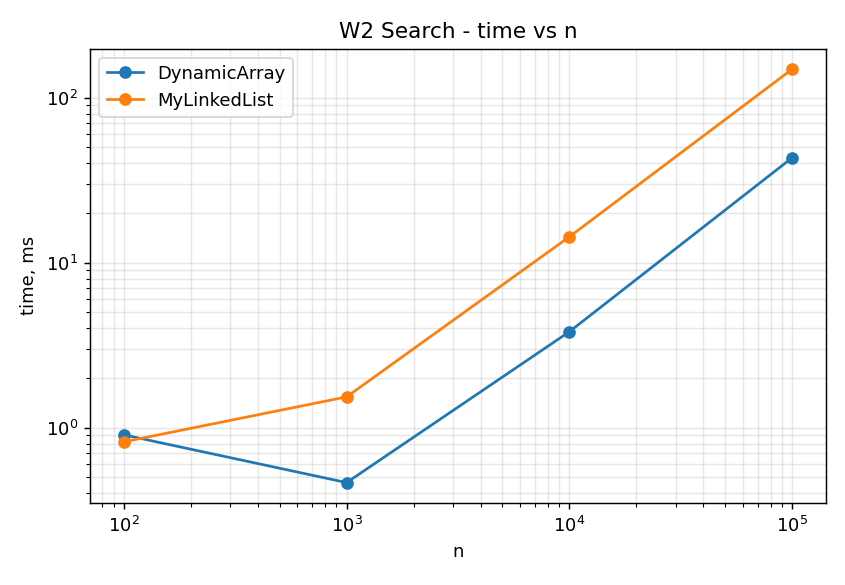
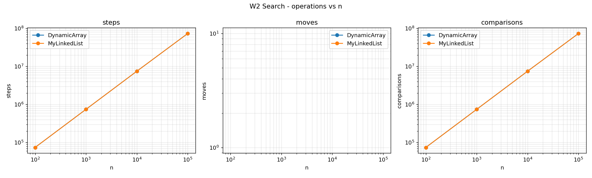
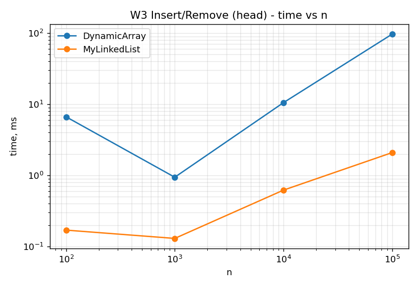
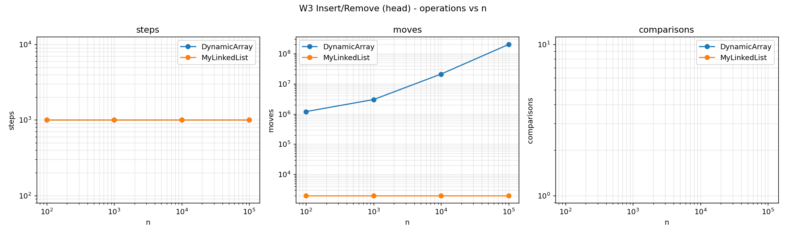
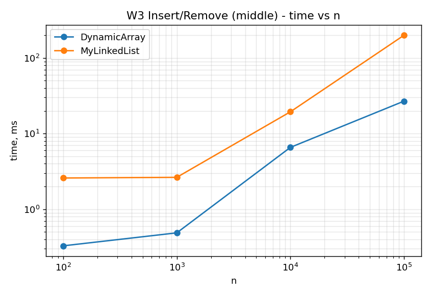
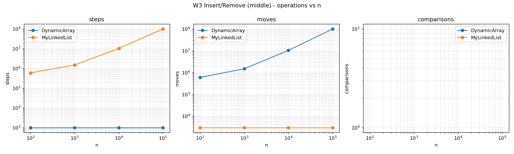
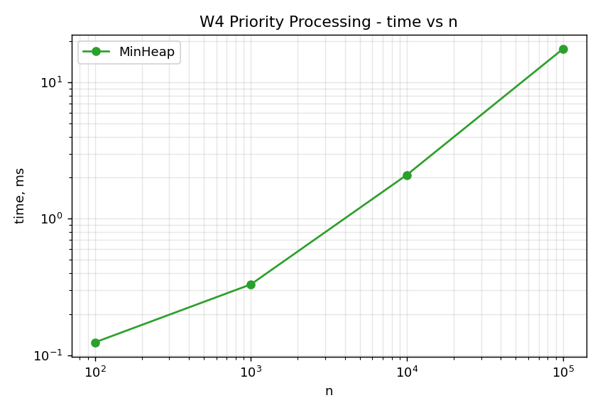
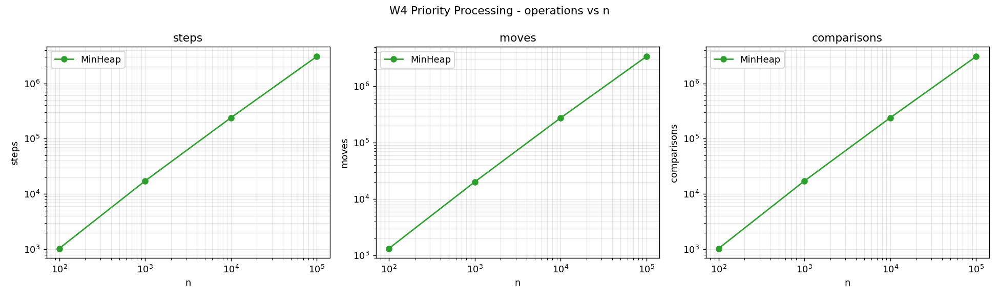

# Report — Assignment 2 (DynamicArray, MyLinkedList, MinHeap)

## 1. Complexity table

| Structure | Operation | Best | Average | Worst | Why |
|---|---|---|---|---|---|
| DynamicArray | add(x) (append) | Θ(1) | Θ(1) amortized | Θ(n) | worst case is exactly when the array is full and has to grow + copy everything |
| DynamicArray | add(index, x) | Θ(1) | Θ(n) | Θ(n) | best = insert at the end (no shift), worst/avg = insert near the front, shifts almost everything |
| DynamicArray | remove(index) | Θ(1) | Θ(n) | Θ(n) | same idea, best = remove the last element, worst = remove the first |
| DynamicArray | get(index) | Θ(1) | Θ(1) | Θ(1) | direct index math, doesn't matter where in the array |
| DynamicArray | contains(x) | Θ(1) | Θ(n) | Θ(n) | best = value is at index 0, worst = value is last or missing entirely |
| DynamicArray | aux. space | — | Θ(n) | — | array can be up to 2x bigger than size because of the growth strategy |
| MyLinkedList | add(x) (append) | Θ(1) | Θ(1) | Θ(1) | tail pointer means no traversal needed |
| MyLinkedList | add(index, x) | Θ(1) | Θ(n) | Θ(n) | best = head or tail, worst/avg = somewhere in the middle, needs traversal |
| MyLinkedList | remove(index) | Θ(1) | Θ(n) | Θ(n) | best = remove head, worst = remove near the tail (singly linked, can't walk backwards) |
| MyLinkedList | get(index) | Θ(1) | Θ(n) | Θ(n) | best = index 0, worst = last index, no way to jump directly |
| MyLinkedList | contains(x) | Θ(1) | Θ(n) | Θ(n) | same reasoning as DynamicArray's contains |
| MyLinkedList | aux. space | — | Θ(n) | — | bigger constant than the array — every node also stores an object header + a pointer |
| MinHeap | insert(x) | Θ(1) | Θ(log n) | Θ(log n) | best = new value already belongs where it landed, no bubble-up needed; worst = bubbles all the way to the root |
| MinHeap | peekMin() | Θ(1) | Θ(1) | Θ(1) | minimum is always sitting at index 0 |
| MinHeap | extractMin() | Θ(1) | Θ(log n) | Θ(log n) | best = the element we move to the root already fits; worst = bubbles all the way down to a leaf |
| MinHeap | aux. space | — | Θ(n) | — | same growth strategy as DynamicArray under the hood |

## 2. Loop invariant proofs

### Proof 1 — MyLinkedList.get(index)

```java
Node current = head;
for (int i = 0; i < index; i++) {
    current = current.next;
    metrics.step();
}
metrics.step();
return current.value;
```

**Invariant:** before each iteration of the loop, `current` points to the node at position `i` in the list (counting from 0 at `head`).

**Initialization:** before the first iteration, `i = 0` and `current = head`. By definition the head is position 0, so the invariant holds right away.

**Maintenance:** assume the invariant holds before some iteration — `current` is at position `i`. The loop body does `current = current.next`, which moves it to position `i + 1`. Since `i` also becomes `i + 1` for the next check, the invariant is still true going into the next iteration.

**Termination:** the loop stops once `i == index` (`i < index` becomes false). By the invariant, at that point `current` is sitting at position `index` — exactly the node we were asked for.

**Conclusion:** since `current` always matches position `i`, and the loop runs exactly until `i = index`, the final `current.value` is guaranteed to be the value stored at `index`. That's what makes `get(index)` correct.

### Proof 2 — MinHeap.bubbleDown(index)

```java
while (true) {
    int left = 2 * index + 1;
    int right = 2 * index + 2;
    int smallest = index;

    if (left < size && data[left] < data[smallest]) smallest = left;
    if (right < size && data[right] < data[smallest]) smallest = right;

    if (smallest == index) break;
    swap(index, smallest);
    index = smallest;
}
```

**Invariant:** before each iteration, the whole array already satisfies the min-heap property (every parent ≤ its children) *everywhere except possibly at position `index`* — meaning `data[index]` might currently be bigger than one of its children, but every other parent/child pair in the array is fine.

**Initialization:** `bubbleDown` is only ever called right after we put one "possibly wrong" value at `index` (either the very first call after moving the last element to the root in `extractMin`, or a recursive step from this same loop). Everywhere else in the array was already a valid heap before this value got placed, so the invariant holds before the first iteration.

**Maintenance:** assume the invariant holds before an iteration. We look at `data[index]` and its (up to two) children and find `smallest`. If `smallest == index`, the parent-child relation at `index` is already fine, so there's nothing left to fix (this is exactly the termination case below). Otherwise we swap `data[index]` with `data[smallest]`: the smaller of the three values now sits at the old `index` position, which fixes the one spot that could have been wrong, and the bigger value moves down to position `smallest` — which can only possibly violate the heap property *at `smallest`*, since `smallest`'s own children were untouched and already satisfied the heap property relative to the old, smaller value there. So after the swap, the array is a valid heap everywhere except possibly at the new `index` (= old `smallest`) — the invariant holds again for the next iteration.

**Termination:** every iteration either breaks immediately (`smallest == index`) or moves `index` strictly one level down the tree, and the tree only has about log₂(n) levels — so the loop can't run forever, it either finds `smallest == index` or `index` falls off the bottom (no children left, so `smallest` stays `index` automatically). Either way, the loop always ends with `data[index] ≤` both of its children (or it has none).

**Conclusion:** the invariant says only `index` could be broken, and termination guarantees `index` isn't broken anymore either — so when the loop exits, the *entire* array satisfies the heap property. That's what proves `extractMin()` (and `insert`'s `bubbleUp`, by the same kind of argument in reverse) always leaves a valid heap behind.

## 3. Benchmark

Ran all 4 workloads on n = 100 / 1 000 / 10 000 / 100 000, 5 runs each (median), data generated with `new Random(42)` so both structures always get identical input. Full numbers in `results/results.csv`, charts in `results/plots/`.

### W1 — Random Access (10 000 `get(index)` calls)




This is the cleanest result in the whole assignment. DynamicArray's `steps` count stays flat at exactly 10 000 no matter what n is — makes sense, `get` is always 1 step. MyLinkedList's steps explode: 502 498 at n=100, up to **500 687 098** at n=100 000. That matches the theory almost exactly — average index is about n/2, times 10 000 calls, gives roughly n·5000, and 100 000 × 5000 = 500 000 000, right in line with what we measured.

Time follows the same story but even more dramatically: at n=100 000, DynamicArray takes 5.867 ms, MyLinkedList takes **1006.876 ms** — about 172x slower, for "only" ~50 000x more steps. That gap between the step-count ratio and the time ratio is the point of the whole assignment (more on this in the discussion).

### W2 — Search (1 000 `contains(x)` calls)




Here both structures do the exact same number of steps/comparisons at every n (e.g. 73 422 709 for both at n=100 000) — `contains` just scans linearly either way, no shortcuts for either structure. But DynamicArray still finishes in 43.152 ms vs MyLinkedList's 148.448 ms at n=100 000, about 3.4x faster **despite identical operation counts**. This is the clearest proof that "same Big-O, same op count" doesn't mean "same real speed."

### W3 — Insert & Remove (head vs middle)






**Head variant** is where MyLinkedList actually wins, and wins big: at n=100 000, DynamicArray needs 201 000 000 moves (shifting almost the whole array 1000 times) and takes 96.629 ms, while MyLinkedList just relinks the head pointer each time (2000 moves total) and takes 2.089 ms — about **46x faster**.

**Middle variant** is the interesting one: both structures end up doing roughly the same total amount of work (~100 500 000 for DynamicArray's moves, ~100 498 500 for MyLinkedList's steps — basically identical, since both need to reach position n/2 somehow, one by shifting, one by walking). But DynamicArray still finishes in 26.855 ms vs MyLinkedList's 199.667 ms — **7.4x faster with virtually the same op count**. Same lesson as W2, even more striking because the numbers line up almost exactly.

### W4 — Priority Processing (MinHeap only)




Steps grow close to n·log₂(n) as expected (steps / (n·log₂n) stays around 1.6–1.84 across all four sizes, not perfectly flat but clearly not growing or shrinking by orders of magnitude) — consistent with n inserts + n extracts, each Θ(log n). No surprises here, the heap behaves like the theory says.

## 4. Discussion

**Why DynamicArray wins at `get(i)` and even plain scanning (W2), despite doing the same or fewer "steps":**
The real reason is CPU cache. An `int[]` is one contiguous block of memory — when the CPU reads `data[50]`, it doesn't just load one int, it pulls in a whole 64-byte cache line (16 ints) at once, so nearby reads (`data[51]`, `data[52]`...) are already sitting in fast cache and cost almost nothing extra. That's called spatial locality. A linked list's nodes are separate objects, scattered wherever the JVM's heap allocator happened to put them — there's no guarantee `node.next` is anywhere near `node` in memory. Walking the list means "pointer chasing": each `current = current.next` is very likely a cache miss, and a cache miss can cost 50-100x longer than a cache hit. That single effect is why W1 and W2 showed such a huge time gap even when the *step counts* were close (W2) or wildly different in the array's favor anyway (W1).

**Why the list can be slower even with the exact same step count (W2, and almost-the-same in W3 middle):**
Pointer chasing again, plus two smaller effects. First, every `Node` object in Java carries an object header (typically 12-16 bytes of JVM bookkeeping) on top of the actual `int value` and the `next` pointer — so a list of n ints uses noticeably more total memory than a plain `int[]` of the same n, meaning more cache lines get touched overall just to hold the data. Second, all these small Node objects put more pressure on the garbage collector — more live objects for the GC to track, which can show up as random pauses that make `MyLinkedList` benchmarks noisier.

**When MyLinkedList is actually the better choice:**
Exactly what W3's `head` variant shows — if the main thing you're doing is adding/removing from one end repeatedly (a queue, an undo stack, a work list processed FIFO), MyLinkedList is Θ(1) with no shifting at all, while DynamicArray has to move almost the whole array every single time. 96.629 ms vs 2.089 ms isn't a small difference.

**When MinHeap is the better choice:**
Whenever the main operation is "give me the smallest (or largest) thing right now, repeatedly" — like a job scheduler or an event queue ordered by time. A sorted array or list could also give you the min in O(1), but keeping it *sorted* after every insert costs O(n) per insert. MinHeap gets O(1) peek and O(log n) insert/extract at the same time, which is why it's the standard structure for this kind of workload (exactly what W4 demonstrates).

**Why the numbers aren't a perfectly clean line:**
JVM warm-up (the JIT hasn't compiled hot methods yet on the very first calls, which is why we throw away one warm-up run before taking the median of 5), the garbage collector (MyLinkedList allocates a lot more small objects, so a GC pause landing mid-run shows up as an outlier more often for it than for DynamicArray), and CPU cache effects that get stronger as n grows past what fits in L2/L3 cache (which is a big part of why the time gap between the two structures actually widens at n=100 000 rather than staying constant).
